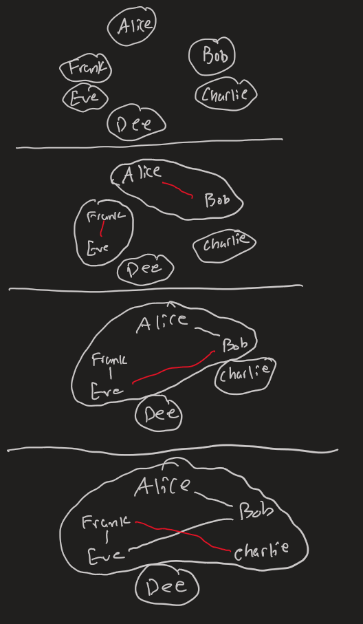

* TOC
{:toc}

# Introduction

In this series, I will explain how type inference works and walk through implementing it for a small language in Haskell. This part doesn't require any experience with Haskell, since it's all conceptual. However, general knowledge of functional languages and/or "expression-oriented" languages will be helpful for understanding the constructs of the language we create, like let-expressions, if expressions, lambdas/anonymous functions, and currying.

In this part, we learn about what type inference is and how to describe a type system for a language.

This part of the tutorial is largely based on the wikipedia article for [Hindley–Milner type system](https://en.wikipedia.org/wiki/Hindley%E2%80%93Milner_type_system). Specifically, this tutorial walks through Algorithm J.

# What is type inference?
A language like Java has what is called a static type system. In Java, if you try to do something silly like pass a `String` to a method that expects an `int`, the type checker will tell you that you made a mistake before your code even runs.

This is great, because it catches a lot of errors before you even think about running your code. But the drawback is that you have to tell Java the types of all of your variables and the signatures of all of your methods. And when you want to write polymorphic code, you have to use generics, which are a little finicky and have ugly syntax.

## the dream

In languages like Haskell and OCaml, we get all the safety of a static type system, but without the hassle of type annotation! For example, consider the following definition in Haskell:
```haskell
applyFunction f x = f x
```
Haskell infers the type of `applyFunction`:
```haskell
applyFunction :: (a -> b) a -> b
```
It knows that `applyFunction` takes in a function from `a` to `b` and a value of type `a` and returns a value of type `b`. And I didn't have to write a type anywhere. And it even knows the function is polymorphic!

So how does this dark magic work? To find out, let's implement type inference for a very simple language.

# Our language

To demonstrate a basic type inference system, we will use a very simple language.

We will consider the whole program to be just one expression. Here is what an expression can be:

$$
e = x\ |\ true\ |\ false\ |\ n
|\ \textrm{if}\ e_1\ \textrm{then}\ e_2\ \textrm{else}\ e_3 |\ \lambda x.e\ |\ e_1 e_2\ |\ \mathrm{let}\ x = e_1\ \mathrm{in}\ e_2
$$


So we have variables, booleans, natural numbers, anonymous functions, function application, and let bindings for local variables.

In case this syntax is confusing, here's how we'd implement function composition in this language:

$$
\lambda f.\lambda g.\lambda x. f(g\ x)
$$
In haskell, we could have written
```haskell
\f g -> (\x -> f (g x))
```


This function takes in two functions `f,g` and calls `g` first and then calls `f` on the result.
Here is the same example using a let binding to create a local variable:

$$
\lambda f.\lambda g.\lambda x. \textrm{let}\ x' = g\ x\ \textrm{in}\ f\ x'
$$

### side note on currying
In functional languages, it is common for multi argument functions to actually be single argument functions that return other functions. For example, if we have the function `add x y = x + y`, it's the same as `add = \x -> (\y -> (x+y))`. The `add` function is really a single argument function that takes in `x` and returns another single argument function that takes in `y` and that function finally returns `x+y`. So when you see a signature like `nat -> nat -> nat`, if we drew the parentheses, we'd write `nat -> (nat -> nat)`. This may seem like unnecessary complexity, but it's actually very helpful. For example, we can partially apply functions like `addFive = add 5`. Now `addFive` is a function of type `nat -> nat` which adds 5 to whatever number you gave it. Notice how we didn't have to say `addFive y = add 5 y`, because of partial application. This idea of using single argument functions that return other functions to "simulate" multi-argument functions is called currying.

---

You might be thinking "this doesn't look like a programming language, this looks like math!" That's what I thought when I first saw something like this. It is math, actually! This language is based on an even simpler one called the lambda calculus, which is the theoretical foundation for modern functional programming languages. Basically, when someone comes up with a new fancy type system, they formalize it like this in terms of simple constructs. These rules generalize to languages that look more like coding languages.

In fact, usually, when presenting this kind of type system, people don't even have numbers or booleans in the language! The rules for the kind of type system we're making don't "care" about the primitive types. Or to be more precise, there is nothing special about numbers and booleans with respect to making type inference. The rules would work for a language with no primitive types at all. I just added them to make things a little less abstract.

Ok, now we know what our language looks like and how it works. So ... type inference time? Not so fast. What even is a type in our langauge?

# types

To start off, there are primitive types: `nat` and `bool`

There are also function types. For example, the type of this function

$$ \lambda b. \textrm{if}\ b\ \textrm{then}\ 1\ \textrm{else}\ 0
$$
is `bool -> nat`. But what is the type of this function?

$$
\lambda x.x
$$

This is the identity function. It takes in anything and just returns it. It can take in a number, a boolean, a function, anything. We don't want to restrict this function to being able to only take in one type of value, because it works for all types. To capture this notion of polymorphism, we need a "forall" construction, or something like that. At any rate, the type of the identity function is

$$
\forall a. a \rightarrow a
$$

The upside down A is read "for all".

This means for all types `a`, this function has type `a -> a`.
Here is another example:

$$
\lambda f.\lambda x. f\ x
$$
It's our old friend `applyFunction`! Here is its type:
$$
\forall a.\forall b.(a \rightarrow b) \rightarrow a \rightarrow b
$$
Notice how there are two foralls and two types mentioned. This is because the function `f` can be from any type to any other type. As long as `x` has the same type as the input of `f`, the whole thing results in a `b`, which is the output type of `f`. So using these type variables like `a,b` and these foralls, we can talk about polymorphic types very precisely.

But why use forall? An equally valid type for that expression is
$$
(bool \rightarrow int) \rightarrow bool \rightarrow int
$$

Interesting. So there is more than one way to assign a type to an expression. We will revisit this once we talk about inference.

Wait a minute, the Haskell inferred type for `applyFunction` didn't have any foralls in it. Why not? In Haskell, and most languages, all the foralls are on the outside like in this type, so it is implied that all type variables have a forall on the outside of a type. We'll go into why Haskell has all of its types' foralls on the outside in a moment.

Here is a weird case:

$$
\lambda id.\lambda f.\lambda x. (id\ f)(id\ x)
$$
If we think of `id` as the identity function, we might try to assign this expression the type
$$
\forall c. \forall a.\forall b. (c \rightarrow c) \rightarrow (a \rightarrow b) \rightarrow a \rightarrow b
$$

But this doesn't work, because in `id f`, we see that `c` must be `a -> b`. But then, we call `id x`, so `c` is also `a`. That doesn't make sense. We need an inner forall:

$$
\forall a. \forall b. (\forall c.c \rightarrow c) \rightarrow (a \rightarrow b) \rightarrow a \rightarrow b
$$

Now, `c` can be different things in the body of the first lambda. The difference is that before, the forall was outside the whole type. So there was "only one `c`". But now, we know that identity function works for all `c`. This is a very subtle difference, but it's very important. Make sure you understand this.

The difference is that before, `c` could only get "instantiated" once (to `a -> b`) since it was in the outer forall. And in the second way, `c` could get instantiated as many times as you want since the forall is inside its little type instead of outside of the whole signature.

We will make this notion of instantiation more concrete soon.

Being able to put foralls in the middle of a type like this would be very nice so you can write functions like this where you need parameters themselves to be polymorphic functions, but unfortunately, type inference is impossible if we allow this in general. So we will only allow foralls on the outside. But variables bound defined in a let expression can have polymorphic types in the body of the let expression, so we can get around this restriction. This system is called let-bound polymorphism. [Here](https://en.wikipedia.org/wiki/Parametric_polymorphism) is a wikipedia article explaining the different kinds of parametric polymorphism.

Ok, so foralls on the outside only. No big deal. Now we're ready to define what a type is. We have mono types, which have no foralls, and type schemes, which are a bunch of foralls and a mono type:

$$
\textrm{mono type: }\tau = a\ |\ nat\ |\ bool\ |\ \tau_1 \rightarrow \tau_2
$$
$$
\textrm{type scheme: } \sigma = \tau\ |\ \forall a.\sigma
$$

So mono types can be type variables, primitive types, or function types. And type schemes are a bunch of foralls with a mono type inside. This langauge doesn't have any structured data like lists or tuples, but it is not too difficult to add that sort of thing in. But I'll keep it simple for this guide, and maybe expand the type system in a future post.

Now we have to define a system of typing expressions. Recall that an expression could be assigned multiple types. How do we choose? For example,
$$
\lambda x.x
$$

Should the type be
$$
\forall a.a \rightarrow a
$$
or
$$
nat \rightarrow nat
$$
?

Well let's say you had a function that needs to take in a value of type `nat -> nat`. If you had a function of type `forall a. a -> a`, that function can serve as a `nat -> nat` function. Just instantiate `a` to `nat`! so `forall a. a -> a` "is a" `nat -> nat`. In other words, anywhere you need a `nat -> nat`, you can instead use a `forall a. a -> a`.

This "is a" stuff sounds a lot like subtyping in a language like Java. In fact, it is a subtyping relationship! Polymorphic types are subtypes of monomorphic types that "fit" them like in this example. Or more precisely, polymorphic type schemes are subtypes of their instantiations. Cool.

So if we have an expression, we should try to assign it the most general, polymorphic type since it is the most versatile.

Now we are ready to describe the type rules for our language. At first, these rules will be declarative, and not really conducive to an algorithm that we can reasonably implement. It will just be to describe the idealized type system. We will then transform these rules to be more like an algorithm so we can implement it.

Before we finally get to the rules, I have to introduce some definitions and notation. While typing a sub-expression of a larger expression, there will likely be variables defined outside which are used in the sub expresssion. For example, `let id = \x.x in let one = 1 in id one`. When we are trying to assign a type to `id one`, we need to know the types of `id` and `one`. So we need to keep track of a context which maps variables that are in scope to their types. Specifically, to their type schemes, since the type of a variable might be polymorphic. This context will be denoted with the letter $\Gamma$, and it will contain a set of variable-type scheme pairs.

A typing judgement will be written like this:
$$
\Gamma \vdash e:\tau
$$

This means that in the context $\Gamma$, the expression $e$ can be assigned the type $\tau$. I say "can be assigned the type" rather than "has the type" or "is inferred to have the type" becase this declarative rule system only tells us what judgements/typings are valid, not which ones are "best" or even how to come up with typings. For that, we will need an algorithmic rule system, which I will introduce later.

Often times, typing judgements will have requirements. Some things that must be true for the judgement to pass. For example,

$$
\frac{(x:\sigma) \in \Gamma}{\Gamma \vdash x:\sigma}
$$

This says that a variable reference has type $\sigma$ when the annotation $x:\sigma$ is in the typing context $\Gamma$.

I like to read these judgement rules clockwise. Start by reading the expression on the bottom, read all the requirements on top from left to right, then look at the type at the bottom.

We also have to talk about free variables. The free variables of a type scheme are those which occur in the mono type, but aren't bound by a forall. For example, in the type
$$
\forall a. a \rightarrow b
$$
The type variable $b$ is a free variable, but not $a$, since it is bound by the forall. All variables in a mono type are free variables since mono types have no foralls to bind type variables. The free variables of a context $\Gamma$ is the union of free variables of all type schemes in annotations in the context.

Now to define the subtyping relationship:

One scheme is a subtype of another, written
$$
\forall a_1.\forall a_2...\forall a_n.\tau \sqsubseteq \forall b_1.\forall b_2...\forall b_m.\tau'
$$
When there exists an instantiation of the first scheme such that it equals the second mono type, assuming none of the bound variables of the second scheme occur free in the first scheme. For example,
$$
\forall a. a \rightarrow a \sqsubseteq nat \rightarrow nat
$$
If we instantiate $a$ to $nat$. And

$$
\forall a. \forall b. a \rightarrow b \sqsubseteq \forall c.c \rightarrow c
$$

under the instantiation $a \mapsto c,b \mapsto c$.

Great. Now we're finally ready for the rules!

# Declarative Rule System

This rule system will tell us which type assignments for expressions are valid, but it isn't useful for making a type inference algorithm to figure out what types to actually assign. You'll see why this is the case, and afterwards, we'll create an algorithmic rule system which can be used to create a type inference algorithm.

First, the rule for variables that I showed you earlier:

$$
\frac{(x:\sigma) \in \Gamma}{\Gamma \vdash x:\sigma} Var
$$

All this says is that a variable is assigned a type if its type is known in the context. Pretty straightforward.

Notice that $x$ is assigned a (possibly polymorhic) type scheme, not a mono type. We'll see why soon.

Here are the rules for natural number and boolean literals:

$$
\frac
{}
{\Gamma \vdash n : nat} Nat
$$

$$
\frac
{}
{\Gamma \vdash true : bool} True
$$

$$
\frac
{}
{\Gamma \vdash false : bool} False
$$


Here is the rule for function application:

$$
\frac{\Gamma \vdash e_1:\tau \rightarrow \tau'\qquad \Gamma \vdash e_2: \tau}{\Gamma \vdash e_1\ e_2:\tau'} App
$$

This says that for a function application, if the function has some function type and the argument has the same type as the function's argument type, the whole application is assigned the function's return type.

Notice that these are all mono types. But a function can have a polymorphic type scheme, right? As it turns out, when a function is applied, if it has a polymorphic type, that scheme gets instantiated on the spot to the appropriate mono type. Right now, this happens magically from a rule I'll introduce in a moment, but we'll see how to revise these rules later to make them implementable.

Here is the rule for lambda expressions, or anonymous functions:

$$
\frac{\Gamma,(x:\tau) \vdash e: \tau'}{\Gamma \vdash \lambda x.e : \tau \rightarrow \tau'} Abs
$$

This rule is named $Abs$ for lambda abstractions. This rule says that if you add an annotation that $x$ has type $\tau$ and the body has type $\tau'$ under that modified context, then the function has a type $\tau \rightarrow \tau'$. This makes sense because function application can be thought of as just substituting all occurences of $x$ with the argument in $e$. So if $x$ has a certain argument type $\tau$, whatever type $e$ has is what the function returns, so the whole function has type $\tau \rightarrow \tau'$. 

Notice again that all the types are mono types. The fact that $x$ has a mono type when typing $e$ is why that weird function with $id$ before couldn't be typed with foralls on the outside. A mono type only has one type and can't be reinstantiated in the body, $e$.

This rule doesn't create polymorphic functions, but there will be a generalization rule which "schemifies" mono types that can be made polymorphic.

Now the rule for let bindings:
$$
\frac{\Gamma \vdash e_1:\sigma \qquad \Gamma, (x:\sigma) \vdash e_2 : \tau}{\Gamma \vdash \textrm{let } x = e_1 \textrm{ in } e_2 : \tau} Let
$$

So if the right-hand-side $e_1$ has a possibly polymorphic type scheme $\sigma$, we just add the annotation that $x$ has type $\sigma$ and type the body $e_2$. But It's important not to think of these rules as "finding" types for expressions. They are really just rules for what type assignments are valid, they don't really "do" anything in some sense. There could be multiple $\tau$s that satisfy this judgement, for example. This just says what would be valid.

Notice that the variable $x$ has a type scheme! This is what let-bound polymorphism is all about. The right-hand-side expression can have a polymorphic type and it can be used polymorphically in the body of the statement. All polymorphism comes from let bindings, in a sense.

The only places where variables are added to the context is lambdas and let bindings. Lambdas annotate variables with mono types, and lets annotate variables with type schemes. That's let-bound polymorphism.

Another thing to notice is that this rule does not assert that the most general scheme is assigned for $e_1$ like we talked about before. It just says that whatever type is assigned plays nicely with the rest of the rule. To get this control over maximum generalization, we'll have to wait for the algorithmic typing rules.

Here is the rule for if expressions:

$$
\frac
{\Gamma \vdash e_1 : bool \qquad \Gamma \vdash e_2 : \tau \qquad \Gamma \vdash e_3 : \tau}
{\Gamma \vdash \textrm{ if } e_1 \textrm{ then } e_2 \textrm{ else } e_3 : \tau} If
$$

The condition has to be a boolean and the two branches must have the same type. The whole expression has the same type as the branches.

Now here are the "magic" instantiation and generalization rules:

$$
\frac
{\Gamma \vdash e: \sigma' \qquad \sigma' \sqsubseteq \sigma}
{\Gamma \vdash e:\sigma}
Inst
$$

Remember $\sigma' \sqsubseteq \sigma$ means $\sigma'$ is a subtype of $\sigma$. In other words, a $\sigma'$ "is a" $\sigma$.

So this rule says you can assign a type to an expression, you can also assign any super type of that type to it. For example, if an expression can be assigned a type `Circle`, then it can be assigned a type `Shape` too. In that example, $\sigma'$ would be `Circle` and $\sigma$ would be `Shape`.

This rule is how foralls are transformed into mono types. Since $\forall a. a \rightarrow a \sqsubseteq nat \rightarrow nat$, the identity function can be instantiated into the `nat`-only identity function. It's also how polymorphic functions get "magically" instantiated to appropriate monomorphic types in rules like $App$. This rule has to happen "behind the scenes" for polymorphic functions to be called with their appropriate monomorphic instantiations. Again, this rule says nothing about _how_ to instantiate, just that it is allowed if we follow subtyping rules. We'll get more control and clarity in the algorithmic rule system.

So if I typed $\textrm{let } id = \lambda x.x \textrm{ in } id\ 1$, the variable $id$ might be assigned type $\forall a. a \rightarrow a$, but when it's called, it must be instantiated with the type $nat \rightarrow nat$, which is valid since this instantiation follows the subtyping rules.

Great. Now fo the generalization rule:

$$
\frac
{\Gamma \vdash e : \sigma \qquad a \notin \textrm{free} (\Gamma)
}
{\Gamma \vdash e : \forall a. \sigma
}
Gen
$$

Remember, the free variables of a context are the union of the free variables of the schemes in the contexts, and the free variables of a scheme are the variables that aren't bound by a forall.

But how would there be free variables in a context? Let's say we're figuring out the type of the identity function $\lambda x.x$. If we assign a mono type $a$ to $x$, the body has type $a$. So the lambda has a type $a \rightarrow a$. And that's a mono type, no foralls. Let's say $a$ wasn't a free variable of the context $\Gamma$ before we started. The context only had a variable annotation in it when typing the body of the lambda. After we assign the type of the lambda, the context is empty, or whatever it was before we started typing the lambda, so we can assign the type $a \rightarrow a$, where $a$ is not a free variable of the context.

This rule says that you can just add a forall to a type scheme as long as the type variable isn't free in the context. So in the identity function example, since $a$ isn't a free variable of the context $\Gamma$, we can generalize this assignment to $\forall a. a \rightarrow a$.

Hooray! We just assigned our first polymorphic type! Now we have seen the whole journey of generalization to assign a polymorphic type and instantiation to use it monomorphically, like in $\textrm{let } id = \lambda x.x \textrm{ in } id\ 1$

That's our declarative rule system. We can't make a good algorithm out of this, because we have no idea how to pick substitutions for instantiation and no idea when we should generalize. Here are all of the "magic" parts that we need to get rid of to make a rule system that could be used for an inference algorithm:

* how do we know when to generalize schemes?
* how do we know which foralls to add when we _do_ generalizes schemes?
* how do we know when to instantiate schemes?
* how do we know what mono types to use when we _do_ instantiate schemes?
* how do we know what mono type to use for the argument when inferring the type of a lambda?

We have this idealized declarative rule system for determining which type assignments make sense for our type language. But we can't make an algorithm out of it because there is too much "magic" in the rules. Now, we must make another rule system for _inferring_ types of expressions in a way that satisfies the declarative rule system, and without "magic" so we can make a type inference algorithm out of it. This is the algorithm rule system.

Before we the algorithmic rule system, here are all of the rules for the declarative rule system:

$$
\frac{(x:\sigma) \in \Gamma}{\Gamma \vdash x:\sigma} Var
$$
$$
\frac
{}
{\Gamma \vdash n : nat} Nat
$$

$$
\frac
{}
{\Gamma \vdash true : bool} True
$$

$$
\frac
{}
{\Gamma \vdash false : bool} False
$$

$$
\frac{\Gamma \vdash e_1:\tau \rightarrow \tau'\qquad \Gamma \vdash e_2: \tau}{\Gamma \vdash e_1\ e_2:\tau'} App
$$
$$
\frac{\Gamma,(x:\tau) \vdash e: \tau'}{\Gamma \vdash \lambda x.e : \tau \rightarrow \tau'} Abs
$$
$$
\frac{\Gamma \vdash e_1:\sigma \qquad \Gamma, (x:\sigma) \vdash e_2 : \tau}{\Gamma \vdash \textrm{let } x = e_1 \textrm{ in } e_2 : \tau} Let
$$
$$
\frac
{\Gamma \vdash e_1 : bool \qquad \Gamma \vdash e_2 : \tau \qquad \Gamma \vdash e_3 : \tau}
{\Gamma \vdash \textrm{ if } e_1 \textrm{ then } e_2 \textrm{ else } e_3 : \tau} If
$$
$$
\frac
{\Gamma \vdash e: \sigma' \qquad \sigma' \sqsubseteq \sigma}
{\Gamma \vdash e:\sigma}
Inst
$$
$$
\frac
{\Gamma \vdash e : \sigma \qquad a \notin \textrm{free} (\Gamma)
}
{\Gamma \vdash e : \forall a. \sigma
}
Gen
$$

# Algorithmic Rule System

This type system we've been creating is known as a Hindley-Milner type system. This particular ruleset we're about to make is for a type inference algorithm called Algorithm J.

Before we get to the rules, we need some more tools and definitions. First, let's define how to generalize a mono type $\tau$ under a given context $\Gamma$.

$$\bar{\Gamma}(\tau) = \forall \hat{a}.\tau \qquad \hat{a} =\textrm{free}(\tau) - \textrm{free}(\Gamma)
$$

This means take all the variables free in $\tau$, except those in the context $\Gamma$, and forall them around $\tau$. The $\forall \hat{a}$ just means a bunch of foralls. The reason we don't take all the free variables in $\tau$ is because, as we'll soon see, the context is going to be filled with "constrained" type variables that might actually be solved to specific mono types like `nat`. But don't worry about that yet, we'll get there.

The way this algorithm will work is by generating type variables for types we don't know yet, and asserting certain constraints on them as we learn more about them. The way we will assert those constraints is with a process called unification.

Unification uses a data structure called a union find. If you aren't familiar, a union find is used when you have a set of values and you want to group them together by some relationship. 

For example, let's say we have a set of people, some of which are friends with each other. Let's assume the friendship relationship is symmetric, so if Alice is friends with Bob, Bob is friends with Alice. We want to keep track of friendship groups, where people are in the same group if there is some chain of friendships connecting them.

Let's say we have Alice, Bob, Charlie, Eve, Dee, and Frank. Nobody is friends at first, so there are 6 groups, each with just one person. But then Alice and Bob become friends, and Eve and Frank become friends. We now have 4 groups: (Alice, Bob), (Charlie), (Dee), (Eve, Frank). Now let's say Bob and Eve become friends. Now we have (Alice, Bob, Eve, Frank), (Charlie), (Dee). Even though Bob and Frank aren't directly friends, they are in the same group because we can follow the chain of friendships Bob -> Eve -> Frank. But Charlie still isn't friends with anyone, so he is in his own group :(. Let's say charlie and Frank become friends. Now we have (Alice, Bob, Charlie, Eve, Frank), (Dee). Dee will stay alone.



That's the the union operation, but what is find? Find tells us whether two people are in the same group. More precisely, we'll keep track of a representative from each group, and find will take an object and return its representative.

We'll implement the union find as a Map from objects to their representatives. Every object starts out being its own representative. Union will set one object't representative to the other's representative, and find will follow the chain until it reaches an object who is its own representative. This is necessary since these chains may develop. A more efficient implementation is possible, but this is simple and correct.

We will use a union-find of mono types to keep track of what types should be equal. Equality is symmetric and transitive, just like friendship in our example, so a union find is perfect to keep track of this. If we want to assert that two types are equal, we just union them and make them friends :).

We need to be careful with the "direction" we unify things in. If we say a type variable `a` should be equal to `nat -> nat`, we want the representative of `a` to be `nat -> nat`, not the other way around. That's all we need to do, because as it turns out, we will only be unioning type variables with other types. 

We are keeping track of mono type equality because we will have "in-progress" or "constrained" type variables floating around, but we will only generalize a mono type once it's "done". We don't want to assert scheme equality, because that would get messy. We will just use the union find to keep track of the solutions of type variables.

Here is the unification algorithm in pseudocode:
```
unify(ta, tb):
    ta = find(ta)
    tb = find(tb)
    // if ta was a type variable, this replaces it with its value, if there is one.
    if ta and tb are both function types
        unify their argument and return types
    else if ta and tb are the same primitive type
        do nothing
    else if ta is a type variable
        if ta occurs in tb:
            // example: unify(a,a -> a) is impossible. That's an infinite type
            throw occurs error
        else
            // ta's representative is now tb
            union(ta,tb)
    else if tb is a type variable
        if tb occurs in ta
            throw occurs error
        else
            // tb's representative is now ta
            // note the reversed order from the previous case
            union(tb,ta)
    else
        // these types are different and can't be equal
        // example: unify(bool, nat)
        throw type mismatch error
```

So we find the types `ta,tb` to replace constrained type variables with their actual values, if we have found them. For example, if we previously called `unify(a,nat)`, `find(a)` would be `nat`. So if we call `unify(a,nat);unify(a,bool)`, the second call will end up trying to unify `nat,bool` and mismatch. For function types, if we called `unify(a->a, nat->bool)`, we'd end up calling `unify(a,nat)` first. Then, we'd call `unify(a,bool)`, which would fail because it would `find` `a` to be `nat`, which would cause a mismatch. For something like `unify(a->(b->c), nat->(bool->bool))` we'd call `unify(a,nat)`, then `unify(b->c, bool->bool)`, which would produce its own recursive calls and eventually hit the type variable base cases and union them.

If you wanted to add tuple types or algebraic data types, the unification would have to check that two types are from the same type constructor, and zip through the type constructor's arguments and unify them. For example, to unify the tuple types `unify((a,b,c), (nat, bool, t))`, we'd call `unify(a,nat); unify(b,bool); unify(c,t)` If the type constructors don't match, we throw a mismatch error like before.

Ok, now we know how to assert that two types are equal, and we know how to generalize mono types to type schemes. Now, all that's left is to instantiate schemes and come up with the type for a lambda argument. These problems have the same solution: `newvar`. We simply create a new type variable that isn't used anywhere else. Since all type variables will be created this way, we can just keep track of a stream of type variables `a1,a2,a3,...` and take the next one and advance the stream every time we need a `newvar`. So newvar generates a never-before-used mono type variable.

When we want to instantiate a scheme $\forall a.\sigma$, we just take the outermost forall, generate a $newvar$ $\tau$, and replace $a$ with $\tau$. We repeat this until there are no more foralls, and we're left with a mono type that has a bunch of unsolved type variables, waiting to be unified!

Now we're ready for the rules! This is what we've all been waiting for.

Here is the rule for variable references:

$$
\frac
{(x:\sigma) \in \Gamma \qquad \tau=instantiate(\sigma)}
{\Gamma \vdash x : \tau}
Var
$$

In the context, variables can have type schemes. So when we reference a variable, if its type is polymorphic, we instantiate the scheme and infer the resulting mono type. So if the context $\Gamma$ contains $(id : \forall a. a \rightarrow a)$, and we were inferring the type of $\lambda f. \lambda x. (id\ f)\ (id\ x)$, the scheme $\forall a. a \rightarrow a$ would get instantiated twice, one for each variable reference. And they would get instantiated with different type variables, so it's ok if the type of $f$ is different than the type of $x$.

Since we're using let-bound polymorphism, the only expressions with polymorphic types are variables, so variable references are the only place we need to instantiate schemes.

The rules for natural number and boolean literals are unchanged:

$$
\frac
{}
{\Gamma \vdash n : nat} Nat
$$

$$
\frac
{}
{\Gamma \vdash true : bool} True
$$

$$
\frac
{}
{\Gamma \vdash false : bool} False
$$

Here is the rule for function application:

$$
\frac{\Gamma \vdash e_1 : \tau_1 \qquad\Gamma\vdash e_2 : \tau_2 \qquad \tau' = newvar \qquad unify(\tau_1,\tau_2 \rightarrow \tau')}
{\Gamma \vdash e_1\ e_2 : \tau'}App
$$

We infer the type of the function and the argument expressions. Then, we make sure that $\tau_1$ is a function type that takes in the type of the argument expression $\tau_2$, and returns $\tau'$. The whole application has the type $\tau'$ since that's the type the function returns. In general, when we want a type to have a specific shape, like a function type, we can just make some `newvar`s and do some unification like we did. For example, if you want to assert that expression is a 3-tuple, you'd do
$$\Gamma \vdash e : \tau \qquad \tau_{1,2,3}=newvar \qquad unify(\tau,(\tau_1,\tau_2,\tau_3))$$

Notice how we don't directly infer a function type like the declarative rule system. We have to take whatever gets inferred, and use `newvar` `unify` to assert the details of the type $\tau$. $e_1$ might be inferred to have a function type, or it might be an unconstrained variable type, which would then be solved to be a function type when we unify.

Also notice that this rule, as well as $Var$ infer mono types. In fact, all our rules will infer mono types. Type schemes only exist in the context, and are instantiated away in variable reference expressions.

Here is the rule for lambda expressions:

$$
\frac
{\tau = newvar \qquad \Gamma,(x:\tau) \vdash e : \tau'}
{\Gamma \vdash \lambda x.e : \tau \rightarrow \tau'}
Abs
$$

We have no idea what the type of $x$ should be, so we just make a `newvar` and let it get solved appropriately with any unification that may happen while inferring the type of the body $e$. Whatever type $e$ gets inferred to be is the return type of the function, and $x$'s type is the argument type, so the whole lamdba is inferred to have the type $\tau \rightarrow \tau'$

It may bother you that $\tau$ is just some type variable that will get solved later, but we use $\tau$ it instead of its "solution" when inferrring the function type. Why not use its solution as the argument type? As it turns out, due to the way unification works, it really makes no difference. If we try to unify this function type with some other type, in `unify`, $\tau$ will be `find`ed to have its solution, so it all works out.

This is all well and good for the internal workings of the type checker, but what if I want to _show_ the user of my language what the type of something is? It wouldn't be very helpful to say "Oh you want the type of that lambda you wrote? It's $a_{22} \rightarrow a_{47}$. Have a nice day." We want to show the fully solved type. We'll get more into that once we implement this in code, but in short, you define a function `findMono`. This function recurses on a mono type until it hits a type variable. Then, it uses the union find to `find` what this variable "really is", and replaces it with its solution. But you actually need to call `findMono` on the solution too, because that type may also contain variables which need to be replaced by their solutions. You stop once you hit a variable whose representative in the union find is itself. In other words, when `find(a) == a`.

But the fact that we generate a `newvar` is important for polymorphism. Consider inferring the type of the identity function $\lambda x.x$. If `newvar` leads to $\tau = a$, we infer the body, $x$, to have type $a$. So the whole lambda has type $a \rightarrow a$. And if we generalized this, we'd get $\forall a . a \rightarrow a$. So that's where the type variables for polymorphic functions come from. The `newvar` in the lambda rule creates the type variables that are eventually "foralled" in polymorphic functions.

Here is the rule for let:

$$
\frac
{\Gamma \vdash e_1 : \tau \qquad \sigma = \bar{\Gamma}(\tau) \qquad \Gamma,(x:\sigma) \vdash e_2 : \tau'}
{\Gamma \vdash \textrm{ let } x = e_1 \textrm{ in } e_2 : \tau'}
Let
$$

First, we infer the type of the right-hand-side $e_1$. It is some mono type $\tau$. Since we're doing let-bound polymorphism, here is where we generalize. Recall that $\bar{\Gamma}(\tau)$ genralizes $\tau$ as much as possible to a type scheme $\sigma$. We say that $x$ has type $\sigma$, so it can be used polymorphically in the body $e_2$, and infer the type of the body to be $\tau'$ under that modified context. The whole let expression is inferred to have the type $\tau'$.

In the declarative rule system, $e_1$ was directly inferred to have a type scheme as a type. Here, $e_1$ is inferred to have a mono type and we generalize it in the annotation $(x:\sigma)$ that we add to the context $\Gamma$ when inferring the type of the body $e_2$. No magic required!

Here is the if expression rule:

$$
\frac
{\Gamma \vdash e_1 : \tau_1 \quad unify(\tau_1,bool) \quad \Gamma \vdash e_2 : \tau_2 \quad \Gamma \vdash e_3 : \tau_3 \quad unify(\tau_2,\tau_3)}
{\Gamma \vdash \textrm{ if } e_1 \textrm{ then } e_2 \textrm{ else } e_3 : \tau_2} If
$$

The main difference is that instead of $e_1:bool$ and so on, we have to infer a normal mono type, and then use `unify` to assert details. We explicitly assert that the condition's type is a boolean and the branches have the same type.

Here is the generalization rule:

Just kidding! There is none. There is also no instantiation rule. Instead of getting their own rules which would have to be magically applied to make an inference algorithm, generalization and instantiation happen explicitly and under our contol in the $Let$ and $Var$ rules respectively. Even then, polymorphism only really "exists" in the context $\Gamma$, since no expression is ever directly inferred to have a type scheme type.

Here are all the rules for the algorithmic rule system:

$$
\frac
{(x:\sigma) \in \Gamma \qquad \tau=instantiate(\sigma)}
{\Gamma \vdash x : \tau}
Var
$$

$$
\frac
{}
{\Gamma \vdash n : nat} Nat
$$

$$
\frac
{}
{\Gamma \vdash true : bool} True
$$

$$
\frac
{}
{\Gamma \vdash false : bool} False
$$

$$
\frac{\Gamma \vdash e_1 : \tau_1 \qquad\Gamma\vdash e_2 : \tau_2 \qquad \tau' = newvar \qquad unify(\tau_1,\tau_2 \rightarrow \tau')}
{\Gamma \vdash e_1\ e_2 : \tau'}App
$$

$$
\frac
{\tau = newvar \qquad \Gamma,(x:\tau) \vdash e : \tau'}
{\Gamma \vdash \lambda x.e : \tau \rightarrow \tau'}
Abs
$$

$$
\frac
{\Gamma \vdash e_1 : \tau \qquad \sigma = \bar{\Gamma}(\tau) \qquad \Gamma,(x:\sigma) \vdash e_2 : \tau'}
{\Gamma \vdash \textrm{ let } x = e_1 \textrm{ in } e_2 : \tau'}
Let
$$

$$
\frac
{\Gamma \vdash e_1 : \tau_1 \quad unify(\tau_1,bool) \quad \Gamma \vdash e_2 : \tau_2 \quad \Gamma \vdash e_3 : \tau_3 \quad unify(\tau_2,\tau_3)}
{\Gamma \vdash \textrm{ if } e_1 \textrm{ then } e_2 \textrm{ else } e_3 : \tau_2} If
$$

That's it! We now have all the rules and tools to make a type inference algorithm. All that's left to do is translate these mathematical rules into code, which is exactly what we'll do in the next part!

## Side note on algorithm W

The algorithm with the union find we described is known as algorithm J. This algorithm eagerly enforces type equality constraints with the `unify` function. Unification could cause checking to fail with an error in the middle of the program since it happens right away. But why do we do this? If all we care about is a bunch of type equalities, why not just accumulate a bag of equations and solve them all at the end? That's what algorithm W does, roughly. But I find algorithm J more intuitive, and it generalizes nicely if you want to add new language features like pattern matching. Although, I've only implemented algorithm W for small, simple languages like this one. Anyway, I recommend looking into it if you're curious. I might even do a tutorial on algorithm W some day to understand it better myself!
