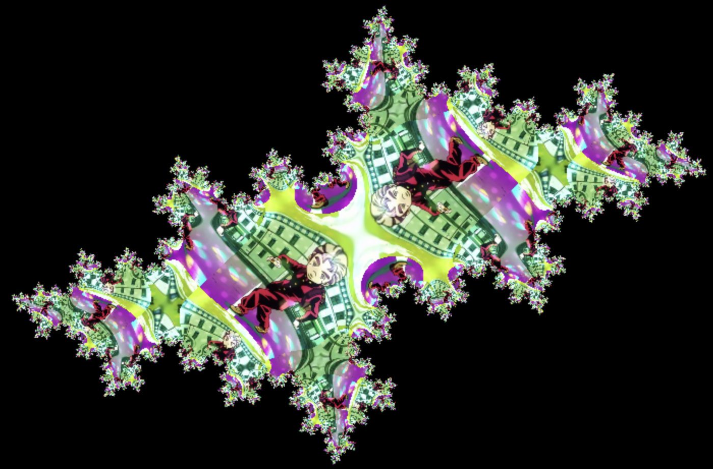
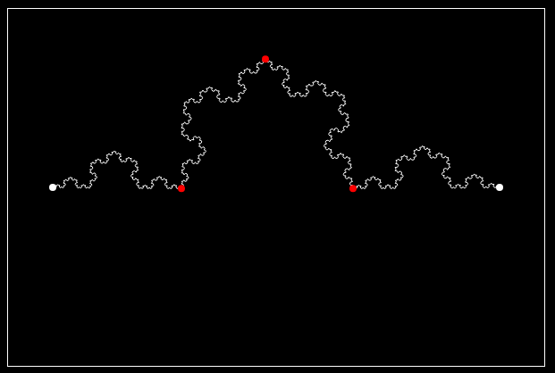

* TOC
{:toc}

This page contains JavaScript projects that run right in your browser. Most of them are interactive visualizations or games. These are not listed in any precise order, but I generally put the more interesting and new stuff at the top.

Some of these projects were based on videos by [The Coding Train](https://www.youtube.com/channel/UCvjgXvBlbQiydffZU7m1_aw). This channel is what got me into making interactive visualizations, which is what most of these projects are. Most of the source code is [here](https://github.com/quasarbright/quasarbright.github.io/tree/master/p5js)

## [Minesweeper](https://quasarbright.github.io/minesweeper)

Guess-free minesweeper with an animated solver. [Source code here](https://github.com/quasarbright/minesweeper)

## [Dinner Debt](https://quasarbright.github.io/dinner-debt)

A little tool to figure out how much you owe someone for dinner. [Source code here](https://github.com/quasarbright/dinner-debt)

## [Image to Julia Set](./julia-image)

Upload an image and see it get transformed into a julia set. This was vibe-coded using cursor and claude 3.7 sonnet.

[](./julia-image)

## [Seam Carving](./seam-carving)

Shrinking an image by removing the "least interesting" seams of pixels.


## [Fractal Curve Editor](./fractal-curve-editor/)

[](./fractal-curve-editor)

Create a fractal curve from a seed pattern of line segments by replacing each segment with a scaled copy of the whole seed.

This was vibe-coded.

## [Mandelbrot Set](https://quasarbright.github.io/p5js/mandelbrotShaderRenormalized/)
[](https://quasarbright.github.io/p5js/mandelbrotShaderRenormalized/)
Instead of coloring each pixel discretely based on the iteration count upon escape,
This shader uses a continuous coloring which takes into account the iteration count
as well as the modulus of the final value. Since it's colored continuously, it can have some very pretty colors.

Zoom by scrolling and pan the camera by clicking and dragging

## [Julia Set](https://quasarbright.github.io/p5js/juliaShader/)
[](https://quasarbright.github.io/p5js/juliaShader/)
This shader uses the same coloring method as the Mandelbrot set shader, but you can select the c-value used to
generate the julia set by clicking/dragging the mouse on the screen. You can also zoom in and out with the mouse wheel.
If you want to pan the camera, you can do so by holding the mouse wheel down and moving the mouse.

## [Magnet Pendulum](https://quasarbright.github.io/p5js/magnetShader/)
[](https://quasarbright.github.io/p5js/magnetShader/)
The fractal is generated from simulating a magnetic pendulum swinging over a table with three magnets on it. Each pixel is colored based
on which magnet it ends up at and darkened based on how long it took to stop at a magnet. The three magnets oscillate radially from the center to
create an interesting visual effect. You can adjust all of the parameters of the simulation to change how it looks and moves.

You can move around by clicking and dragging and zoom in and out by scrolling.

This one is really heavy on the GPU. If it runs too slowly, try decreasing the maximum iterations or making your browser-window smaller.

## [Majority Cellular Automaton](https://quasarbright.github.io/p5js/majority-automaton-gpu)

A multi-state cellular automaton where the next value is determined by majority vote of the neighbors

Which color do you think will win?

[](https://quasarbright.github.io/p5js/majority-automaton-gpu)

This project was originally implemented by me (without AI), and it ran on the CPU, but I vibe-coded a GPU port using cline.

The original CPU version is [here](https://quasarbright.github.io/p5js/majority-automaton).

## [Double Slit Interference](https://quasarbright.github.io/spring-wave/dist/index.html)

A physics-simulation of waves powered by balls connected with springs, demonstrating diffraction and double-slit interference.


## [3 Point Perspective](https://quasarbright.github.io/p5js/3PointPerspective)
[3 point perspective](https://en.wikipedia.org/wiki/Perspective_(graphical)) is a drawing technique to draw realistic-looking objects in 3D. You pick 3 2D points far away from the object you're drawing and lines that would be parallel in 3D actually meet at one of these perspective points.

In this visualization, you can click and drag the 3 white perspective points and one of the vertices of the cube. You can also change the dimensions of the cube with the sliders to the left. It's interesting to see how messing with things changes how the cube looks!

## [Complex Function Grid Transformation](https://quasarbright.github.io/p5js/complex-function-grid-visualizer)


This is an interactive visualization of functions on complex numbers. It shows how points along grid lines get transformed by the complex function.

This was completely vibe-coded using ChatGPT, which was a surprisingly pleasant experience. I didn't even look at the code.

## [Braille Dithering](https://quasarbright.github.io/p5js/braille)
```
⠀⠀⠀⠀⠀⠀⠀⠀⠀⠀⠀⠀⠀⠀⠀⢀⠂⠀⡂⠀⠀⠀⠀⠀⠀⠀⠀⠀⠀⠀⠀⠀⠀⠀⠀⠀⠀⠀⠀⠀⠀⠀⠀⠀⠀⠀⠀⠀⠀⠀⠀⠀⠀⠀⠀⠀⠀⠀⠀⠀⠀⠀⠀⠀⠀⠀⠀⠀⠀⠀⠀⠀⠀⠀⠀
⠀⠀⠀⠀⠀⠀⠀⠀⠀⠀⠀⠀⠀⠀⠀⢀⠂⠀⢂⠀⠀⠀⠀⠀⠀⠀⠀⠀⠀⠀⢀⢔⢡⢑⡑⡢⢄⠀⢀⣀⢀⠀⠀⠀⠀⠀⠀⠀⠀⠀⠀⠀⠀⠀⠀⠀⠀⠀⠀⠀⠀⠀⠀⠀⠀⠀⠀⠀⠀⠀⠀⠀⠀⠀⠀
⠀⠀⠀⠀⠀⠀⠀⠀⠀⠀⠀⠀⠀⠀⠀⢀⠂⢀⠔⢤⠀⠀⠀⠀⠀⠀⠀⠀⠀⠀⢥⠣⢃⠕⢊⠄⡑⢆⢃⠔⠅⢅⠅⠅⠀⠀⠀⠀⠀⠀⠀⠀⠀⠀⠀⠀⠀⠀⠀⠀⠀⠀⠀⠀⠀⠀⠀⠀⠀⠀⠀⠀⠀⠀⠀
⠀⠀⠀⠀⠀⠀⠀⠀⠀⠀⠀⠀⠀⠀⠀⠠⠀⠘⣇⢽⡁⠀⠀⠀⠀⠀⠀⠀⠀⢠⢃⠕⢁⢁⠡⣐⠪⡢⣂⢊⠖⡄⠀⠂⠀⠀⠀⠀⠀⠀⠀⠀⠀⠀⠀⠀⠀⠀⠀⠀⠀⠀⠀⠀⠀⠀⠀⠀⠀⠀⠀⠀⠀⠀⠀
⠀⠀⠀⠀⠀⠀⠀⠀⠀⠀⠀⠀⠀⠀⠀⠠⠁⠀⠱⡨⠄⠀⠀⠀⠀⠀⠀⠀⢀⠣⢁⠆⢁⠄⠪⡠⡱⠑⡕⡰⢱⢘⢄⠀⠀⠀⠀⠀⠀⠀⠀⠀⠀⠀⠀⠀⠀⠀⠀⠀⠀⠀⠀⠀⠀⠀⠀⠀⠀⠀⠀⠀⠀⠀⠀
⠀⠀⠀⠀⠀⠀⠀⠀⠀⠀⠀⠀⠀⠀⠀⠐⠀⠀⠀⠌⡀⠀⠀⠀⠀⠀⠀⠀⠀⠨⡀⢠⣗⡎⡀⠀⡪⢈⠆⡰⣗⡅⡣⠃⠀⠀⠀⠀⠀⠀⠀⠀⠀⠀⠀⠀⠀⠀⠀⠀⠀⠀⠀⠀⠀⠀⠀⠀⠀⠀⠀⠀⠀⠀⠀
⠀⠀⠀⠀⠀⠀⠀⠀⠀⠀⠀⠀⠀⠀⠀⢈⠀⠀⠀⠨⡀⠀⠀⠀⠀⠀⠀⠀⠀⠀⠢⣟⣷⣻⣢⢦⠢⡑⢌⢞⡵⡏⠀⠀⠀⠀⠀⠀⠀⠀⠀⠀⠀⠀⠀⠀⠀⠀⠀⠀⠀⠀⠀⠀⠀⠀⠀⠀⠀⠀⠀⠀⠀⠀⠀
⠀⠀⠀⠀⠀⠀⠀⠀⠀⠀⠀⠀⠀⠀⠀⠠⠀⠀⠀⢐⠄⡀⠀⠀⠀⠀⠀⠀⠀⠀⠨⣟⣵⢯⣞⡯⡇⡃⢱⢹⡪⣺⠀⠀⠀⠀⠀⠀⠀⠀⠀⠀⠀⠀⠀⠀⠀⠀⠀⠀⠀⠀⠀⠀⠀⠀⠀⠀⠀⠀⠀⠀⠀⠀⠀
⠀⠀⠀⠀⠀⠀⠀⠀⠀⠀⠀⠀⠀⠀⠀⠀⠅⠀⠀⢳⠨⡇⠀⠀⠀⠀⠀⠀⢀⣀⢨⡿⢵⢟⣞⡞⡡⢐⠱⡫⢗⡽⣠⠢⡠⣀⡀⣀⠀⠀⠀⠀⠀⠀⠀⠀⠀⠀⠀⠀⠀⠀⠀⠀⠀⠀⠀⠀⠀⠀⠀⠀⠀⠀⠀
⠀⠀⠀⠀⠀⠀⠀⠀⠀⠀⠀⠀⠀⠀⠀⠀⠅⠀⠀⠈⡄⡣⠀⠀⠀⠀⠀⡠⣞⡬⡻⣺⡤⡣⣀⣪⢄⡠⡈⣄⢗⠸⡡⡣⡝⡜⠜⢐⠕⡀⠀⠀⠀⠀⠀⠀⠀⠀⠀⠀⠀⠀⠀⠀⠀⠀⠀⠀⠀⠀⠀⠀⠀⠀⠀
⠀⠀⠀⠀⠀⠀⠀⠀⠀⠀⠀⠀⠀⠀⠀⠀⠅⠀⠀⠀⠨⠂⠀⠀⠀⠀⡰⡍⠞⠎⠗⣹⡺⡽⣳⣵⣡⢵⡫⡎⠇⠈⢩⢊⠎⠂⡁⢅⠎⡲⡠⡤⡀⠀⠀⠀⠀⠀⠀⠀⠀⠀⠀⠀⠀⠀⠀⠀⠀⠀⠀⠀⠀⠀⠀
⠀⠀⠀⠀⠀⠀⠀⠀⠀⠀⠀⠀⠀⠀⠀⠀⠅⠀⠀⠀⠈⢌⠀⢀⢤⢪⢕⢍⢆⠄⠂⠸⣺⢝⢥⢥⢥⠥⡳⡱⠁⡜⡌⡢⠡⡑⢌⢆⠇⠇⡃⠑⠩⡀⠀⠀⠀⠀⠀⠀⠀⠀⠀⠀⠀⠀⠀⠀⠀⠀⠀⠀⠀⠀⠀
⠀⠀⠀⠀⠀⠀⠀⠀⠀⠀⠀⠀⠀⠀⠀⠀⠅⠀⠀⠀⠀⠕⣠⢣⡣⡳⡡⠣⡊⢀⠀⠈⡗⣝⢵⡣⣖⢎⢇⢇⠕⠜⠨⠐⡡⢊⢢⠣⠉⠌⠐⣁⣡⢂⡀⠀⠀⠀⠀⠀⠀⠀⠀⠀⠀⠀⠀⠀⠀⠀⠀⠀⠀⠀⠀
⠀⠀⠀⠀⠀⠀⠀⠀⠀⠀⠀⠀⠀⠀⠀⠀⠅⠀⠀⠀⠀⠡⠪⡊⡎⡎⢎⠪⠀⠄⠀⡌⠜⡜⡪⡪⡪⡪⡪⠪⢘⠨⢨⠨⡂⢕⠡⠊⢈⣴⣫⡷⣫⠿⠽⡿⡀⠀⠀⠀⠀⠀⠀⠀⠀⠀⠀⠀⠀⠀⠀⠀⠀⠀⠀
⠀⠀⠀⠀⠀⠀⠀⠀⠀⠀⠀⠀⠀⠀⠀⠀⠅⠀⠀⠀⠀⠨⢊⢌⢒⠬⠡⡊⠠⢀⡾⣵⡑⢌⠪⡊⡪⡨⡢⡑⠅⡨⢐⠌⠎⡐⢁⣴⣟⡵⠫⠊⠀⠁⢁⠪⡣⠀⠀⠀⠀⠀⠀⠀⠀⠀⠀⠀⠀⠀⠀⠀⠀⠀⠀
⠀⠀⠀⠀⠀⠀⠀⠀⠀⠀⠀⠀⠀⠀⠀⠀⠅⠀⠀⠀⠀⠨⢂⢇⡂⡪⢘⠌⡐⢰⣻⣗⡯⡧⣪⢮⣞⡮⢊⠠⢊⢐⠅⡌⠊⡠⣟⣞⠮⢀⢢⣢⢧⣣⡄⢂⠆⠀⠀⠀⠀⠀⠀⠀⠀⠀⠀⠀⠀⠀⠀⠀⠀⠀⠀
⠀⠀⠀⠀⠀⠀⠀⠀⠀⠀⠀⠀⠀⠀⠀⠀⠅⠀⠀⠀⠀⠀⠅⡎⡪⢐⠡⡡⠂⠜⢵⣻⢞⡽⣺⡽⡞⠔⢁⠂⠡⠂⡑⢀⢡⢞⡽⡪⢂⢵⢳⢝⡽⡵⣟⡇⠀⠀⠀⠀⠀⠀⠀⠀⠀⠀⠀⠀⠀⠀⠀⠀⠀⠀⠀
⠀⠀⠀⠀⠀⠀⠀⠀⠀⠀⠀⠀⠀⠀⠀⠀⠅⠀⠀⠀⠀⠀⡅⡫⢔⠡⢊⢐⠈⡈⢘⠮⡯⣺⠳⢉⠔⡡⢁⠌⠌⠌⠂⠠⡪⡫⡪⠂⠔⢕⢇⠧⣓⢝⡮⡚⠀⠀⠀⠀⠀⠀⠀⠀⠀⠀⠀⠀⠀⠀⠀⠀⠀⠀⠀
⠀⠀⠀⠀⠀⠀⠀⠀⠀⠀⠀⠀⠀⠀⠀⠀⠅⠀⠀⢀⣴⣾⢀⢪⡣⡨⢂⠕⠠⢹⠂⡈⠫⠂⢀⢕⠌⠄⢂⠌⠢⠁⡠⡑⠕⡍⡢⠁⠊⣐⢕⡭⣪⡪⡪⣺⢶⣄⠀⠀⠀⠀⠀⠀⠀⠀⠀⠀⠀⠀⠀⠀⠀⠀⠀
⠀⠀⠀⠀⠀⠀⠀⠀⠀⠀⠀⠀⠀⠀⠀⠀⠅⠀⣴⣿⢿⣳⢡⠐⣗⠌⡢⢊⠔⠁⠊⢀⠔⠈⠄⢌⠂⠌⠔⡨⠊⢀⢆⢎⢎⢐⠔⠀⠀⠸⣻⣽⡷⣫⢞⣽⢯⢾⣻⡄⠀⠀⠀⠀⠀⠀⠀⠀⠀⠀⠀⠀⠀⠀⠀
⠀⠀⠀⠀⠀⠀⠀⠀⠀⠀⠀⠀⠀⠀⠀⠀⠅⣸⣷⢟⣽⢽⣰⢃⢿⢕⠥⡂⡊⣀⡴⡞⣽⢝⣗⡧⣆⠅⠅⠀⢄⢮⡪⡪⡮⡢⡢⡀⠀⠀⡫⣾⣻⡽⡕⣯⡳⣝⢾⢅⠀⠀⠀⠀⠀⠀⠀⠀⠀⠀⠀⠀⠀⠀⠀
⠀⠀⠀⠀⠀⠀⠀⠀⠀⠀⠀⠀⠀⠀⠀⢀⡵⣫⡾⡝⣦⡟⡮⡣⢡⡕⢝⢎⡦⢳⢹⡺⡵⣫⢮⡮⣗⣇⠁⣌⢮⢪⢮⠪⡪⡺⡪⡢⡒⢕⢜⢪⢞⡽⣪⡳⣣⣯⢗⣯⠀⠀⠀⠀⠀⠀⠀⠀⠀⠀⠀⠀⠀⠀⠀
⠀⠀⠀⠀⠀⠀⠀⠀⠀⠀⠀⠀⠀⣠⣾⣿⣺⣯⢞⢟⢧⡣⣏⡧⢑⢑⢵⠩⡊⠀⡉⢄⠃⠯⡃⠍⡪⣪⡲⣕⡵⣧⠓⠝⠔⠕⢕⡝⢮⢮⢂⣁⣵⡽⣮⣾⣯⣾⣻⣷⣃⠀⠀⠀⠀⠀⠀⠀⠀⠀⠀⠀⠀⠀⠀
⠀⠀⠀⠀⠀⠀⠀⠀⠀⠀⠀⠀⠠⣿⡿⣾⢽⣟⢏⣧⢗⠕⡱⢫⠐⣐⢡⢕⠌⡂⢪⢺⡊⠌⡀⢐⢌⠪⡘⢮⢺⢕⡇⠫⡫⡣⡆⢝⣗⣟⡯⣟⡾⣻⢽⢞⣗⢯⢟⡾⣳⡀⠀⠀⠀⠀⠀⠀⠀⠀⠀⠀⠀⠀⠀
⠀⠀⠀⠀⠀⠀⠀⠀⠀⠀⠀⠀⠀⢫⢞⣯⢿⠁⢟⢮⢟⣦⡂⠂⠀⡃⢖⢽⣊⡠⢪⠊⠀⢂⣌⡢⣂⠕⡨⢊⠪⡱⡑⠘⠌⠎⠀⠨⡪⡞⡮⣳⢝⢎⢗⠝⡜⢝⠕⡝⡕⣇⠀⠀⠀⠀⠀⠀⠀⠀⠀⠀⠀⠀⠀
⠀⠀⠀⠀⠀⠀⠀⠀⠀⠀⠀⠀⠀⢸⢝⢵⡫⡂⠈⢊⠪⡺⢵⢢⢐⠜⣜⢽⡺⠀⠀⢀⠠⢹⢦⡢⡱⡝⡎⡖⢅⠪⡀⡄⣀⠀⠀⢨⢂⠕⠩⡊⡪⢃⠣⢋⢂⢅⢊⡠⡪⣳⠀⠀⠀⠀⠀⠀⠀⠀⠀⠀⠀⠀⠀
⠀⠀⠀⠀⠀⠀⠀⠀⠀⠀⠀⠀⠀⠀⠋⠚⠎⠚⠑⠐⠙⢜⢐⠅⠅⢔⢱⢹⠊⠀⠀⠂⠌⠠⢙⢑⠪⡪⢊⠪⢑⠨⠨⠨⢂⠝⢴⠁⠀⠈⠘⠰⠨⠢⡱⠑⠕⡑⡕⡘⠜⠌⠀⠀⠀⠀⠀⠀⠀⠀⠀⠀⠀⠀⠀
⠀⠀⠀⠀⠀⠀⠀⠀⠀⠀⠀⠀⠀⠀⠀⠀⠅⠀⠀⠀⠀⠀⠁⢸⠈⢐⠕⠅⢐⢄⠄⠂⠀⡁⢀⠂⠁⢐⠡⠈⡠⠐⢁⠈⠄⢊⢔⠀⠀⠀⠀⠀⠀⠀⠀⠀⠀⠀⠀⠀⠀⠀⠀⠀⠀⠀⠀⠀⠀⠀⠀⠀⠀⠀⠀
⠀⠀⠀⠀⠀⠀⠀⠀⠀⠀⠀⠀⠀⠀⠀⠀⠅⠀⠀⠀⠀⠀⠀⢸⠄⠘⡨⠀⡢⢑⠁⠄⡡⡢⠢⡠⢐⢐⠨⡐⢄⢂⠅⡕⣌⢔⠬⡣⠀⠀⠀⠀⠀⠀⠀⠀⠀⠀⠀⠀⠀⠀⠀⠀⠀⠀⠀⠀⠀⠀⠀⠀⠀⠀⠀
⠀⠀⠀⠀⠀⠀⠀⠀⠀⠀⠀⠀⠀⠀⠀⠀⠅⠀⠀⠀⠀⠀⠀⠈⣊⡆⠂⠈⠀⠁⠀⢊⢪⢪⢡⠢⡑⠔⢕⣕⢧⡣⣣⢣⡪⡳⣫⣞⠀⠀⠀⠀⠀⠀⠀⠀⠀⠀⠀⠀⠀⠀⠀⠀⠀⠀⠀⠀⠀⠀⠀⠀⠀⠀⠀
⠀⠀⠀⠀⠀⠀⠀⠀⠀⠀⠀⠀⠀⠀⠀⠀⠅⠀⠀⠀⠀⠀⠀⠀⡾⡊⠀⠀⠀⠀⠈⢀⠈⠢⡪⡪⠘⠈⢸⣪⢟⣞⡵⣳⢝⢮⡪⣚⢆⠀⠀⠀⠀⠀⠀⠀⠀⠀⠀⠀⠀⠀⠀⠀⠀⠀⠀⠀⠀⠀⠀⠀⠀⠀⠀
⠀⠀⠀⠀⠀⠀⠀⠀⠀⠀⠀⠀⠀⠀⠀⠀⠅⠀⠀⠀⠀⠀⠀⢸⡝⡌⠀⡀⠀⠀⠈⠀⢀⠡⠀⠠⠐⠈⢘⢮⡫⣟⡾⡵⣫⣗⣽⢮⡮⡂⠀⠀⠀⠀⠀⠀⠀⠀⠀⠀⠀⠀⠀⠀⠀⠀⠀⠀⠀⠀⠀⠀⠀⠀⠀
⠀⠀⠀⠀⠀⠀⠀⠀⠀⠀⠀⠀⠀⠀⠀⠀⠅⠀⠀⠀⠀⠀⠀⣯⡺⡀⡪⠐⢔⢲⠀⠈⠀⠀⠀⡀⠄⡠⠂⣯⡺⡵⣻⡽⣯⢾⣞⣿⣿⣵⠀⠀⠀⠀⠀⠀⠀⠀⠀⠀⠀⠀⠀⠀⠀⠀⠀⠀⠀⠀⠀⠀⠀⠀⠀
⠀⠀⠀⠀⠀⠀⠀⠀⠀⠀⠀⠀⠀⠀⠀⠀⠅⠀⠀⠀⠀⠀⢰⣫⠮⠀⠎⡨⠢⡱⠁⢂⠔⢈⠔⣠⢅⡜⣝⢞⣞⣽⣳⢽⣫⡿⣺⣿⣿⣷⣇⠀⠀⠀⠀⠀⠀⠀⠀⠀⠀⠀⠀⠀⠀⠀⠀⠀⠀⠀⠀⠀⠀⠀⠀
⠀⠀⠀⠀⠀⠀⠀⠀⠀⠀⠀⠀⠀⠀⠀⠀⠅⠀⠀⠀⠀⠀⣺⢕⡏⠀⠈⠪⠊⠀⠁⢐⠨⠀⠨⣺⢜⢼⡪⡝⣾⢵⡿⣽⣺⢞⣿⡵⣿⣿⣿⣦⠀⠀⠀⠀⠀⠀⠀⠀⠀⠀⠀⠀⠀⠀⠀⠀⠀⠀⠀⠀⠀⠀⠀
⠀⠀⠀⠀⠀⠀⠀⠀⠀⠀⠀⠀⠀⠀⠀⠀⠅⠀⠀⠀⠀⠠⣟⢽⠀⠀⠀⠀⠀⠐⠀⠂⠀⠐⠈⠈⠃⠣⢫⠀⢿⡽⣻⣽⢷⣻⣵⢿⣳⣟⣿⣿⣷⡀⠀⠀⠀⠀⠀⠀⠀⠀⠀⠀⠀⠀⠀⠀⠀⠀⠀⠀⠀⠀⠀
⠀⠀⠀⠀⠀⠀⠀⠀⠀⠀⠀⠀⠀⠀⠀⠀⠅⠀⠀⠀⠀⢸⡳⣝⠀⠀⠄⠁⠀⠀⠀⠀⠈⠀⠈⠀⠠⠠⠠⡐⡘⣯⢿⣽⢟⣽⣾⣻⣽⢾⡽⣻⣿⡇⠀⠀⠀⠀⠀⠀⠀⠀⠀⠀⠀⠀⠀⠀⠀⠀⠀⠀⠀⠀⠀
```
[Dithering](https://www.wikiwand.com/en/Dither) is a technique that can be used to make an image look shaded despite only having black and white. [Braille](https://www.wikiwand.com/en/Braille) is a writing system that uses raised dots instead of ink letters.  

There are braille characters in computers and they look like this: ⠃⠗⠁⠊⠇⠇⠑  

In the [Unicode encoding for Braille characters](https://www.unicode.org/charts/PDF/U2800.pdf), every possible configuration of dots in a 2x4 grid are encoded, meaning they can basically act as a grid of black and white pixels.  

I combined dithering and Braille together to render an image as text. I resize the image, dither it to black and white, divide it up into little 2x4 grids, and put in the Braille character corresponding to that 2x8 grid of 0s and 1s.

## [Moon Emoji Dithering](https://quasarbright.github.io/p5js/moon-dithering)

```
🌑🌑🌑🌑🌑🌑🌑🌑🌑🌑🌒🌑🌑🌑🌑🌑🌑🌑🌑🌑🌑🌑🌑🌑🌑🌑🌑🌑🌑🌑🌑🌑🌑🌑🌑🌑🌑🌑🌑🌑🌑🌑🌑🌑🌑🌑🌑🌑🌑🌑
🌑🌑🌑🌑🌑🌑🌑🌑🌑🌑🌒🌑🌘🌑🌑🌑🌑🌑🌑🌑🌑🌑🌑🌑🌑🌑🌑🌑🌑🌑🌑🌑🌑🌑🌑🌑🌑🌑🌑🌑🌑🌑🌑🌑🌑🌑🌑🌑🌑🌑
🌑🌑🌑🌑🌑🌑🌑🌑🌑🌑🌑🌑🌑🌑🌑🌑🌑🌑🌑🌑🌒🌘🌘🌘🌘🌑🌘🌑🌑🌑🌑🌑🌑🌑🌑🌑🌑🌑🌑🌑🌑🌑🌑🌑🌑🌑🌑🌑🌑🌑
🌑🌑🌑🌑🌑🌑🌑🌑🌑🌑🌒🌑🌒🌑🌑🌑🌑🌑🌑🌑🌘🌘🌘🌒🌒🌘🌘🌘🌘🌑🌑🌑🌑🌑🌑🌑🌑🌑🌑🌑🌑🌑🌑🌑🌑🌑🌑🌑🌑🌑
🌑🌑🌑🌑🌑🌑🌑🌑🌑🌑🌒🌒🌘🌗🌑🌑🌑🌑🌑🌑🌘🌒🌘🌒🌘🌘🌘🌑🌒🌑🌑🌑🌑🌑🌑🌑🌑🌑🌑🌑🌑🌑🌑🌑🌑🌑🌑🌑🌑🌑
🌑🌑🌑🌑🌑🌑🌑🌑🌑🌑🌒🌑🌘🌘🌑🌑🌑🌑🌑🌒🌘🌒🌘🌘🌘🌘🌘🌘🌑🌑🌑🌑🌑🌑🌑🌑🌑🌑🌑🌑🌑🌑🌑🌑🌑🌑🌑🌑🌑🌑
🌑🌑🌑🌑🌑🌑🌑🌑🌑🌑🌒🌑🌘🌘🌑🌑🌑🌑🌑🌘🌒🌒🌒🌘🌒🌘🌒🌘🌘🌑🌑🌑🌑🌑🌑🌑🌑🌑🌑🌑🌑🌑🌑🌑🌑🌑🌑🌑🌑🌑
🌑🌑🌑🌑🌑🌑🌑🌑🌑🌑🌒🌑🌒🌑🌑🌑🌑🌑🌑🌒🌑🌔🌘🌑🌘🌘🌘🌘🌘🌑🌑🌑🌑🌑🌑🌑🌑🌑🌑🌑🌑🌑🌑🌑🌑🌑🌑🌑🌑🌑
🌑🌑🌑🌑🌑🌑🌑🌑🌑🌑🌑🌑🌑🌘🌑🌑🌑🌑🌑🌑🌘🌕🌘🌘🌘🌘🌔🌘🌘🌑🌑🌑🌑🌑🌑🌑🌑🌑🌑🌑🌑🌑🌑🌑🌑🌑🌑🌑🌑🌑
🌑🌑🌑🌑🌑🌑🌑🌑🌑🌑🌑🌑🌑🌘🌑🌑🌑🌑🌑🌑🌓🌔🌔🌖🌘🌒🌘🌘🌑🌑🌑🌑🌑🌑🌑🌑🌑🌑🌑🌑🌑🌑🌑🌑🌑🌑🌑🌑🌑🌑
🌑🌑🌑🌑🌑🌑🌑🌑🌑🌑🌒🌑🌑🌘🌘🌑🌑🌑🌑🌑🌓🌖🌖🌖🌘🌒🌔🌘🌑🌑🌑🌑🌑🌑🌑🌑🌑🌑🌑🌑🌑🌑🌑🌑🌑🌑🌑🌑🌑🌑
🌑🌑🌑🌑🌑🌑🌑🌑🌑🌑🌒🌑🌒🌘🌗🌑🌑🌑🌑🌑🌓🌖🌖🌖🌘🌘🌔🌔🌒🌘🌑🌑🌑🌑🌑🌑🌑🌑🌑🌑🌑🌑🌑🌑🌑🌑🌑🌑🌑🌑
🌑🌑🌑🌑🌑🌑🌑🌑🌑🌑🌒🌑🌑🌘🌘🌑🌑🌑🌒🌘🌕🌘🌘🌘🌒🌑🌘🌘🌘🌘🌘🌘🌘🌑🌑🌑🌑🌑🌑🌑🌑🌑🌑🌑🌑🌑🌑🌑🌑🌑
🌑🌑🌑🌑🌑🌑🌑🌑🌑🌑🌑🌑🌑🌒🌘🌑🌑🌑🌔🌘🌔🌘🌘🌔🌘🌘🌔🌘🌘🌘🌘🌘🌘🌑🌑🌑🌑🌑🌑🌑🌑🌑🌑🌑🌑🌑🌑🌑🌑🌑
🌑🌑🌑🌑🌑🌑🌑🌑🌑🌑🌒🌑🌑🌒🌑🌑🌑🌒🌘🌘🌘🌔🌘🌖🌘🌖🌘🌑🌘🌘🌑🌒🌒🌘🌘🌑🌑🌑🌑🌑🌑🌑🌑🌑🌑🌑🌑🌑🌑🌑
🌑🌑🌑🌑🌑🌑🌑🌑🌑🌑🌒🌑🌑🌑🌘🌑🌘🌘🌘🌘🌒🌘🌖🌘🌘🌘🌘🌒🌘🌘🌘🌘🌘🌘🌘🌘🌑🌑🌑🌑🌑🌑🌑🌑🌑🌑🌑🌑🌑🌑
🌑🌑🌑🌑🌑🌑🌑🌑🌑🌑🌒🌑🌑🌑🌘🌘🌘🌘🌘🌒🌑🌘🌘🌘🌒🌘🌘🌘🌘🌒🌘🌘🌒🌘🌘🌘🌑🌑🌑🌑🌑🌑🌑🌑🌑🌑🌑🌑🌑🌑
🌑🌑🌑🌑🌑🌑🌑🌑🌑🌑🌑🌑🌑🌑🌘🌘🌘🌘🌒🌘🌑🌘🌘🌘🌘🌘🌘🌒🌑🌒🌘🌘🌒🌒🌘🌕🌘🌑🌑🌑🌑🌑🌑🌑🌑🌑🌑🌑🌑🌑
🌑🌑🌑🌑🌑🌑🌑🌑🌑🌑🌒🌑🌑🌑🌒🌘🌘🌘🌘🌑🌘🌒🌘🌘🌘🌘🌘🌑🌘🌒🌘🌘🌘🌔🌘🌖🌘🌗🌑🌑🌑🌑🌑🌑🌑🌑🌑🌑🌑🌑
🌑🌑🌑🌑🌑🌑🌑🌑🌑🌑🌒🌑🌑🌑🌒🌘🌘🌒🌘🌑🌖🌘🌒🌘🌘🌘🌘🌑🌘🌘🌒🌒🌖🌖🌘🌑🌒🌘🌑🌑🌑🌑🌑🌑🌑🌑🌑🌑🌑🌑
🌑🌑🌑🌑🌑🌑🌑🌑🌑🌑🌒🌑🌑🌑🌒🌘🌘🌘🌘🌒🌔🌘🌘🌘🌘🌘🌒🌒🌘🌘🌒🌖🌖🌒🌒🌘🌑🌘🌑🌑🌑🌑🌑🌑🌑🌑🌑🌑🌑🌑
🌑🌑🌑🌑🌑🌑🌑🌑🌑🌑🌒🌑🌑🌑🌒🌒🌘🌘🌘🌒🌔🌖🌘🌕🌔🌒🌘🌘🌘🌑🌘🌖🌘🌘🌔🌕🌘🌘🌑🌑🌑🌑🌑🌑🌑🌑🌑🌑🌑🌑
🌑🌑🌑🌑🌑🌑🌑🌑🌑🌑🌒🌑🌑🌑🌒🌒🌘🌒🌒🌘🌔🌔🌔🌔🌘🌒🌑🌘🌘🌒🌔🌘🌒🌘🌔🌘🌔🌘🌑🌑🌑🌑🌑🌑🌑🌑🌑🌑🌑🌑
🌑🌑🌑🌑🌑🌑🌑🌑🌑🌑🌒🌑🌑🌑🌒🌘🌘🌒🌒🌑🌘🌔🌘🌗🌘🌒🌑🌒🌑🌘🌘🌘🌒🌘🌘🌘🌖🌘🌑🌑🌑🌑🌑🌑🌑🌑🌑🌑🌑🌑
🌑🌑🌑🌑🌑🌑🌑🌑🌑🌑🌒🌑🌑🌑🌘🌒🌘🌘🌘🌘🌘🌔🌘🌒🌘🌘🌘🌘🌒🌘🌘🌘🌘🌘🌘🌘🌘🌘🌑🌑🌑🌑🌑🌑🌑🌑🌑🌑🌑🌑
🌑🌑🌑🌑🌑🌑🌑🌑🌑🌑🌑🌑🌒🌔🌖🌒🌘🌘🌒🌒🌘🌒🌒🌒🌒🌒🌒🌑🌘🌒🌘🌘🌒🌔🌔🌘🌔🌘🌖🌑🌑🌑🌑🌑🌑🌑🌑🌑🌑🌑
🌑🌑🌑🌑🌑🌑🌑🌑🌑🌑🌒🌑🌖🌖🌖🌘🌘🌘🌒🌑🌑🌘🌘🌒🌒🌒🌑🌘🌘🌘🌘🌑🌑🌔🌖🌖🌖🌖🌖🌖🌑🌑🌑🌑🌑🌑🌑🌑🌑🌑
🌑🌑🌑🌑🌑🌑🌑🌑🌑🌑🌑🌒🌕🌘🌖🌘🌔🌘🌘🌘🌘🌖🌖🌖🌘🌘🌑🌘🌘🌘🌘🌑🌑🌘🌖🌖🌔🌘🌖🌖🌑🌑🌑🌑🌑🌑🌑🌑🌑🌑
🌑🌑🌑🌑🌑🌑🌑🌑🌑🌑🌒🌘🌖🌖🌘🌖🌘🌘🌘🌘🌔🌘🌖🌔🌘🌘🌒🌘🌘🌘🌖🌘🌒🌘🌔🌔🌘🌖🌖🌘🌑🌑🌑🌑🌑🌑🌑🌑🌑🌑
🌑🌑🌑🌑🌑🌑🌑🌑🌑🌑🌘🌖🌖🌔🌘🌖🌘🌘🌘🌘🌘🌘🌔🌔🌘🌘🌘🌘🌘🌘🌘🌘🌘🌘🌘🌘🌖🌔🌖🌖🌘🌑🌑🌑🌑🌑🌑🌑🌑🌑
🌑🌑🌑🌑🌑🌑🌑🌑🌑🌕🌔🌖🌖🌘🌖🌘🌘🌘🌘🌑🌒🌒🌘🌒🌘🌔🌘🌖🌘🌘🌒🌘🌔🌘🌒🌕🌖🌕🌖🌖🌘🌑🌑🌑🌑🌑🌑🌑🌑🌑
🌑🌑🌑🌑🌑🌑🌑🌑🌓🌕🌖🌕🌖🌖🌘🌘🌘🌘🌘🌘🌒🌘🌒🌒🌒🌘🌘🌖🌘🌘🌘🌘🌖🌖🌖🌕🌔🌔🌔🌔🌘🌑🌑🌑🌑🌑🌑🌑🌑🌑
🌑🌑🌑🌑🌑🌑🌑🌑🌒🌖🌖🌖🌘🌕🌘🌒🌒🌘🌘🌘🌘🌘🌘🌘🌘🌘🌘🌘🌘🌘🌘🌒🌘🌖🌘🌖🌘🌘🌘🌖🌔🌑🌑🌑🌑🌑🌑🌑🌑🌑
🌑🌑🌑🌑🌑🌑🌑🌑🌑🌔🌔🌘🌘🌘🌖🌘🌑🌘🌔🌘🌘🌑🌘🌘🌘🌘🌒🌒🌘🌑🌑🌑🌘🌘🌔🌔🌘🌘🌘🌘🌘🌘🌑🌑🌑🌑🌑🌑🌑🌑
🌑🌑🌑🌑🌑🌑🌑🌑🌑🌔🌘🌘🌑🌘🌘🌘🌘🌘🌔🌘🌑🌘🌘🌘🌘🌘🌘🌘🌘🌒🌑🌒🌒🌒🌘🌒🌘🌘🌘🌘🌘🌘🌑🌑🌑🌑🌑🌑🌑🌑
🌑🌑🌑🌑🌑🌑🌑🌑🌑🌒🌘🌘🌘🌒🌘🌒🌒🌘🌘🌑🌘🌒🌒🌘🌘🌘🌘🌒🌒🌘🌘🌘🌑🌒🌘🌘🌘🌘🌘🌘🌘🌑🌑🌑🌑🌑🌑🌑🌑🌑
🌑🌑🌑🌑🌑🌑🌑🌑🌑🌑🌒🌑🌑🌑🌒🌒🌘🌘🌘🌘🌑🌑🌑🌘🌘🌘🌘🌒🌑🌘🌘🌘🌑🌑🌑🌑🌑🌑🌑🌑🌑🌑🌑🌑🌑🌑🌑🌑🌑🌑
🌑🌑🌑🌑🌑🌑🌑🌑🌑🌑🌒🌑🌑🌑🌑🌒🌘🌘🌘🌘🌘🌒🌑🌘🌑🌘🌒🌑🌘🌘🌘🌘🌑🌑🌑🌑🌑🌑🌑🌑🌑🌑🌑🌑🌑🌑🌑🌑🌑🌑
🌑🌑🌑🌑🌑🌑🌑🌑🌑🌑🌒🌑🌑🌑🌑🌒🌘🌒🌑🌘🌑🌘🌘🌘🌘🌒🌘🌒🌒🌘🌘🌘🌑🌑🌑🌑🌑🌑🌑🌑🌑🌑🌑🌑🌑🌑🌑🌑🌑🌑
🌑🌑🌑🌑🌑🌑🌑🌑🌑🌑🌒🌑🌑🌑🌑🌑🌘🌑🌘🌘🌑🌘🌘🌘🌘🌒🌘🌘🌘🌘🌔🌘🌑🌑🌑🌑🌑🌑🌑🌑🌑🌑🌑🌑🌑🌑🌑🌑🌑🌑
🌑🌑🌑🌑🌑🌑🌑🌑🌑🌑🌒🌑🌑🌑🌑🌑🌔🌘🌑🌑🌑🌘🌘🌘🌒🌒🌖🌖🌖🌘🌘🌔🌘🌑🌑🌑🌑🌑🌑🌑🌑🌑🌑🌑🌑🌑🌑🌑🌑🌑
🌑🌑🌑🌑🌑🌑🌑🌑🌑🌑🌒🌑🌑🌑🌑🌒🌘🌘🌑🌑🌑🌘🌒🌘🌑🌘🌖🌖🌖🌔🌘🌘🌘🌑🌑🌑🌑🌑🌑🌑🌑🌑🌑🌑🌑🌑🌑🌑🌑🌑
🌑🌑🌑🌑🌑🌑🌑🌑🌑🌑🌒🌑🌑🌑🌑🌒🌖🌒🌑🌑🌑🌒🌑🌒🌑🌒🌔🌔🌔🌔🌔🌔🌖🌘🌑🌑🌑🌑🌑🌑🌑🌑🌑🌑🌑🌑🌑🌑🌑🌑
🌑🌑🌑🌑🌑🌑🌑🌑🌑🌑🌒🌑🌑🌑🌑🌓🌘🌒🌒🌘🌘🌑🌑🌑🌒🌑🌖🌖🌖🌖🌖🌕🌖🌘🌑🌑🌑🌑🌑🌑🌑🌑🌑🌑🌑🌑🌑🌑🌑🌑
🌑🌑🌑🌑🌑🌑🌑🌑🌑🌑🌒🌑🌑🌑🌑🌔🌘🌒🌘🌘🌘🌒🌑🌘🌘🌖🌖🌔🌔🌔🌔🌕🌕🌘🌑🌑🌑🌑🌑🌑🌑🌑🌑🌑🌑🌑🌑🌑🌑🌑
🌑🌑🌑🌑🌑🌑🌑🌑🌑🌑🌒🌑🌑🌑🌑🌖🌗🌒🌘🌒🌑🌘🌒🌒🌘🌘🌖🌖🌕🌔🌔🌔🌕🌖🌑🌑🌑🌑🌑🌑🌑🌑🌑🌑🌑🌑🌑🌑🌑🌑
🌑🌑🌑🌑🌑🌑🌑🌑🌑🌑🌒🌑🌑🌑🌒🌖🌘🌑🌑🌑🌑🌘🌑🌘🌖🌖🌘🌖🌕🌔🌔🌔🌔🌕🌖🌑🌑🌑🌑🌑🌑🌑🌑🌑🌑🌑🌑🌑🌑🌑
🌑🌑🌑🌑🌑🌑🌑🌑🌑🌑🌒🌑🌑🌑🌓🌘🌘🌑🌑🌑🌒🌑🌒🌒🌘🌘🌘🌖🌕🌔🌖🌖🌖🌕🌕🌘🌑🌑🌑🌑🌑🌑🌑🌑🌑🌑🌑🌑🌑🌑
🌑🌑🌑🌑🌑🌑🌑🌑🌑🌑🌒🌑🌑🌑🌘🌖🌑🌒🌑🌑🌑🌒🌒🌑🌑🌘🌑🌖🌕🌔🌔🌖🌖🌕🌕🌗🌑🌑🌑🌑🌑🌑🌑🌑🌑🌑🌑🌑🌑🌑
🌑🌑🌑🌑🌑🌑🌑🌑🌑🌑🌒🌑🌑🌑🌘🌘🌑🌒🌑🌑🌑🌑🌑🌑🌑🌒🌘🌘🌖🌖🌕🌔🌖🌖🌕🌘🌑🌑🌑🌑🌑🌑🌑🌑🌑🌑🌑🌑🌑🌑
```

Similar to braille dithering, but uses moon phase emojis.

## [Image -> Conway's Game of Life](https://quasarbright.github.io/p5js/image-conway)

Dithers an image to black and white pixels and then runs that in conway's game of life

## [Image -> Conway's Game of Life on the GPU](https://quasarbright.github.io/p5js/gpu-gol)

A GPU-powered version for higher performance. This was vibe-coded using cline.

## [Sand](https://quasarbright.github.io/p5js/sand2)

Add sand, water, stone, acid, fire, and more to the screen and watch them interact.

This is a cellular automaton where each "grain" interacts with its neighbors depending on what material it is.


## [Boids](https://quasarbright.github.io/p5js/boids)

A simulation of bird flocking behavior. The boids try to stay near the center of the flock, avoid getting too close to other boids, and try to head in the same direction and speed as nearby boids. These simple rules lead to some life-like behavior.

[](https://quasarbright.github.io/p5js/boids)

## [2D Random Walkers](https://quasarbright.github.io/p5js/random-walk)

A bunch of random walkers animated with a trail. Each little walker randomly decides to move up, down, left, or right.

[](https://quasarbright.github.io/p5js/random-walk)

## [Raindrops](https://quasarbright.github.io/p5js/raindrops)

Inspired by watching raindrops drip down a car window and collide with each other. Raindrops move down, but their horizontal movement is random. When two drops collide, they combine and the survivor is randomly chosen, with bigger drops being more likely to survive. But small drops still have a chance of winning!

Which drop do you think will win?

[](https://quasarbright.github.io/p5js/raindrops)

## [Wave Equation](https://quasarbright.github.io/p5js/wave-equation)

A numerical approximation of the [wave equation](https://en.wikipedia.org/wiki/Wave_equation), visualized as a heat map. It's like a simulation of the surface of a pond, starting off flat with a few splashes. The error in the approximation leads to interesting behavior where you have regions which are checkerd with maximum and minimum displacement bordering regions with zero displacement. And these regions are stable. So stable that they form a new type of wave that dominates the simulation. It pretty much always ends up in a "checkered wave" state. This looks way cooler than what it would look like if it worked properly, so I left it like this instead of fixing it.

[](https://quasarbright.github.io/p5js/wave-equation)

## [Rock Paper Scissors Cellular Automaton](https://quasarbright.github.io/p5js/rock-paper-scissors-automaton)

A cellular automaton based on rock paper scissors where if a neighboring cell beats this cell, this cell becomes the winner.

[](https://quasarbright.github.io/p5js/rock-paper-scissors-automaton)

## [Conway's Game of Life](https://quasarbright.github.io/p5js/conway)
This is [John Conway's game of life](https://www.wikiwand.com/en/Conway%27s_Game_of_Life), a cellular automaton where cells live or die depending on the state of their neighbors. Click on the cells to toggle their life state and hit start to see what happens.

## [Unbounded Conway's Game of Life](https://quasarbright.github.io/p5js/unbounded-conway)

[](https://quasarbright.github.io/p5js/unbounded-conway)

Conway's game of life, but the size of the world is unlimited. Rather than storing a grid of cells, we store the positions of living cells and update those cells and their neighbors to compute the next generation. The camera automatically zooms out to fit the whole world into view.

## [Genetic Steering](https://editor.p5js.org/mdelmonaco/present/HJpO5IJ7Z)
These creatures need to eat green food and avoid red poison to survive. They starve if they don't eat enough, and have a random chance of reproducing with some mutation at every moment. Each creature has a radius they can see food, a radius for poison, an attractive strength for food, and a repulsive force for poison. What configuration is optimal for survival?

[](https://editor.p5js.org/mdelmonaco/present/HJpO5IJ7Z)

## [Smart Rockets](https://editor.p5js.org/mdelmonaco/present/BkJquZ1Ae)
There are two competing populations of rockets, each using gnetics and evolution to try to learn to reach the target by applying a series of forces to themselves. The populations don't interact with each other, but it's cool to see two at once. The better rockets have a higher chance of reproducing and there is genetic crossover between parents

[](https://editor.p5js.org/mdelmonaco/present/BkJquZ1Ae)

## [Monty Hall Game](https://quasarbright.github.io/monty-hall-game)

Interactive game for the monty hall problem. Includes an explanation of the math.

## [Dragon Curve](https://quasarbright.github.io/p5js/dragon-curve/)

[](https://quasarbright.github.io/p5js/dragon-curve/)

This is the [dragon curve](https://en.wikipedia.org/wiki/Dragon_curve). It's the fractal generated by folding a piece of paper in half over and over again.

## [Ginchology](https://quasarbright.github.io/p5js/ginchology)
This randomly generates two ginchulates, which are a consonant sound, a vowel, and finally, an "nch". Ex: "dench"  
They just sound funny
## [Kana Word Generator](https://quasarbright.github.io/p5js/kanaWordGenerator)
This page randomly generates "Japanese-sounding" words.  
Japanese words are mostly composed of simple consonant-vowel syllables like "ka", and the structure of these words follow simple rules with few exceptions. For example, consonants must be followed by vowels (except "n). I made these rules into a graph. In the graph syllables are vertices, and directed edges represent whether a syllable can follow another syllable. In this case, a syllable is a consonant-vowel pair, "n", or a vowel. The only rule that doesn't fit into this graph is that strings of vowels usually don't go over 2.  
I also tried to include rules that make the generated words sound more Japanese, such as only including syllables which are present in hiragana, restricting which vowels can follow which vowels, and limiting vowel string to a length of 2.
## [Magnetic Pendulum](https://quasarbright.github.io/p5js/magnetic%20pendulum)
This simulates three magnets on a table with a pendulum hanging a magnetic object above the center. Depending on where you release the magnet, you could end up at any of the three magnets. Click and drag to release pendulums and see where they end up. Where the pendulum ends up is extremely sensitive to the initial dropping position. Here is a picture of where a pendulum ends up based on the starting position: 

## [Elastic Sphere Collisions](https://quasarbright.github.io/p5js/elastic-sphere-collision)

A bunch of balls (really circles) colliding with each other elastically, conserving kinetic energy and momentum like billiard balls.

## [Polygon Fractals](https://quasarbright.github.io/p5js/polygon%20fractal)
Colorful polygon fractals. Click to iterate the fractal, press a key to switch between the two fractal modes:  
center mode: draw a dot at the center of a shape and draw the triangles going from the shape's edges to the center  
prism mode: draw a smaller version of the shape inside itself and draw lines connecting it to the old shape
## [Rainbow Radiation](https://quasarbright.github.io/p5js/radiation)
colorful lines fly out of your mouse cursor   
move the mouse and click to make the lines fly out in a spiral
## [random circles with no overlap](https://quasarbright.github.io/p5js/random%20circles%20no%20overlap)
## [random squares with no overlap](https://quasarbright.github.io/p5js/random%20squares%20no%20overlap)
## [Minimum Spanning Tree](https://quasarbright.github.io/p5js/spanning%20tree)
This generates a [minimum spanning tree](https://www.wikiwand.com/en/Minimum_spanning_tree) of a random collection of points. You can add points to see how the MST changes

## [Moving Minimum Spanning Tree](https://quasarbright.github.io/p5js/moving-spanning-tree)
This generates a [minimum spanning tree](https://www.wikiwand.com/en/Minimum_spanning_tree) of a random collection of points that bounce around. You can add points by clicking on the screen


## [Display Graph](https://quasarbright.github.io/p5js/display%20graph)
This allows you to display any graph and then edit the locations of vertices by clicking and dragging. Currently, it randomly generates a graph, but theoretically, the code can be used to display any graph.
## [Travelling salesman problem](https://quasarbright.github.io/p5js/travelling%20salesman)
This solves the [travelling salesman problem](https://www.wikiwand.com/en/Travelling_salesman_problem) for a random collection of points.

## [Sudoku](https://quasarbright.github.io/sudoku/)

Sudoku, implemented using React. [Source code here](https://github.com/quasarbright/sudoku)
